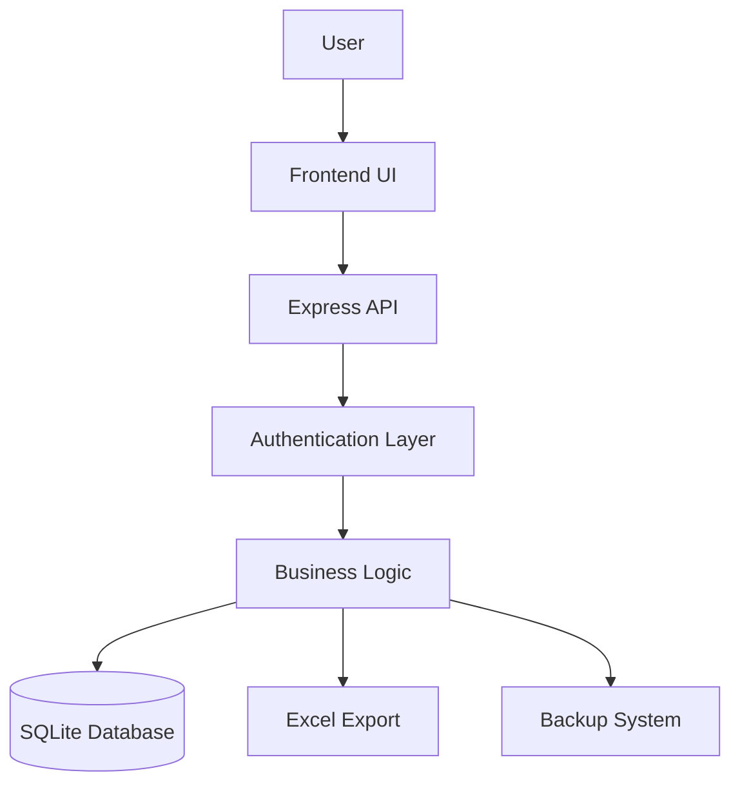
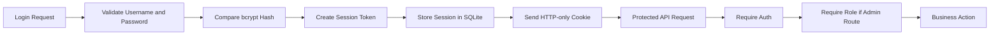
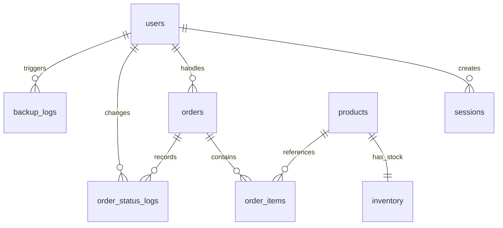

# Cafe-OS

Cafe-OS is a coffee shop operating system built with Node.js, Express, SQLite, and Vanilla JavaScript. It combines a cashier workflow, table-based POI (Point of Interest) mapping, sales reporting, inventory tracking, admin tools, Excel export, and backup management in one local-first web application.

> Note: the current codebase still uses the older product name `POI Coffee` in some file names, database files, package metadata, and UI labels. This README documents the project as **Cafe-OS** while staying accurate to the existing implementation.

## 1. Project Overview

Cafe-OS is designed as a beginner-friendly full-stack project for students who want to learn how a real business application works from UI to database.

Instead of separating the frontend and backend into different repositories, this project keeps everything simple:

- The browser loads a static HTML/CSS/JavaScript interface from Express.
- The frontend calls JSON API endpoints on the same server.
- The backend processes authentication, orders, inventory, admin actions, exports, and backups.
- SQLite stores the operational data in a single local database file.

This makes the project ideal for learning:

- Session-based authentication
- Role-Based Access Control (RBAC)
- CRUD operations
- Order workflows
- Reporting and aggregation
- File generation with Excel
- SQLite backup and restore strategies

## 2. Features

### Core Business Features

- Login with session cookie authentication
- Cashier and admin roles with different permissions
- POS workflow with cart and checkout
- POI table map with `available`, `occupied`, and `reserved` statuses
- Dashboard metrics for revenue, transactions, active orders, and best seller
- Sales filtering by `daily`, `weekly`, and `monthly`
- Order history with status transitions from `Process` to `Done` or `Cancel`
- Inventory reduction on checkout
- Inventory recovery when an order is canceled
- Order status log history for auditability

### Admin Features

- Menu management
- Ingredient management
- User management
- SQLite table browser
- Manual backup creation
- Backup restore from the admin panel
- Excel export for order reports

### Developer and Learning Features

- Fully server-rendered static frontend with no framework dependency
- Single-file Express backend that clearly shows routing, validation, business logic, and persistence
- Seeded demo users, products, ingredients, tables, and initial orders
- Clear example of how frontend state and backend state stay synchronized

## 3. System Architecture

Cafe-OS follows a simple monolithic architecture:

- `public/index.html` defines the interface structure
- `public/app.js` handles user interaction, routing, rendering, and API calls
- `server.js` exposes API routes, business rules, auth checks, reporting logic, backup logic, and SQLite access
- `data/poi_coffee.sqlite` stores persistent data
- `data/backups/` stores generated SQLite backup snapshots

### Overall Architecture



### Request Flow Explained

1. A user opens the web app in the browser.
2. The browser loads static assets from Express.
3. The frontend sends API requests such as login, load dashboard data, create orders, or export reports.
4. Express validates the request, checks the session, and verifies the user role.
5. Business logic reads or updates the SQLite database.
6. The server returns JSON data, an Excel file, or an error message.
7. The frontend re-renders the UI using the latest state.

### Auth and RBAC Flow



## 4. Technology Stack

| Layer | Technology | Purpose |
| --- | --- | --- |
| Runtime | Node.js 18+ | Executes the server |
| Backend Framework | Express | Routing, middleware, static file hosting, API handling |
| Database | SQLite + `sqlite3` + `sqlite` | Embedded local relational database |
| Frontend | HTML, CSS, Vanilla JS | UI rendering and browser-side state management |
| Auth | Cookies + session table + `bcryptjs` | Session login and password hashing |
| Export | `xlsx` | Generates `.xlsx` reports |
| Data Seeding | Node.js script | Creates additional demo users, menus, and ingredients |

### Why this stack is useful for students

- It has very little setup overhead.
- It teaches core backend ideas without hiding them behind heavy abstractions.
- SQLite lets beginners inspect the database easily.
- Vanilla JS makes frontend logic explicit and readable.
- Express shows how REST APIs are structured in practice.

## 5. Database Overview

The application uses a local SQLite database stored in:

```text
data/poi_coffee.sqlite
```

### Main Tables

| Table | Purpose |
| --- | --- |
| `users` | Stores accounts, roles, activation status, failed login attempts, and account lock info |
| `sessions` | Stores active session tokens and expiration timestamps |
| `products` | Stores menu catalog data |
| `inventory` | Stores stock and minimum stock for menu items |
| `ingredients` | Stores raw material or ingredient data |
| `cafe_tables` | Stores physical table IDs, areas, and statuses |
| `orders` | Stores order headers such as code, table, total, status, cashier, and timestamps |
| `order_items` | Stores line items belonging to each order |
| `order_status_logs` | Stores status transition history for auditing |
| `backup_logs` | Stores metadata about generated backup files |

### Database Relationship Overview



### How the data model works

- A `user` can log in and create a `session`.
- A cashier creates an `order`.
- An order contains one or more `order_items`.
- Each item references a product from `products`.
- Product stock is stored separately in `inventory`.
- Status changes are written to `order_status_logs`.
- Backup files are tracked in `backup_logs`.

### Teaching note

This schema is a good example of separating:

- master data: `users`, `products`, `ingredients`, `cafe_tables`
- transactional data: `orders`, `order_items`
- audit and operational data: `sessions`, `order_status_logs`, `backup_logs`

## 6. Installation Guide

### Prerequisites

- Node.js `18` or newer
- npm
- macOS, Linux, or Windows with local filesystem access

### Steps

1. Clone or download the project.
2. Open the project folder.
3. Install dependencies:

```bash
npm install
```

4. Start the application:

```bash
npm start
```

5. Open the browser:

```text
http://localhost:3000
```

### Optional: seed more dummy data

The project already seeds base users, products, ingredients, tables, and sample orders on startup.  
If you want extra demo users and menu data, run:

```bash
npm run seed:dummy
```

This script is designed to be repeatable because it uses upsert-style logic.

## 7. Environment Variables

All environment variables are optional unless your deployment environment requires them.

| Variable | Default | Purpose |
| --- | --- | --- |
| `PORT` | `3000` | HTTP port used by Express |
| `NODE_ENV` | unset | Affects production behavior such as secure cookie handling |
| `COOKIE_SECURE` | auto | Forces cookies to be marked `Secure` when set to `true` |
| `LOGIN_RATE_WINDOW_MS` | `900000` | Login rate-limit window in milliseconds |
| `LOGIN_RATE_MAX_ATTEMPTS` | `30` | Maximum login attempts per IP within the rate window |
| `ACCOUNT_LOCK_THRESHOLD` | `5` | Failed password attempts before temporary account lock |
| `ACCOUNT_LOCK_DURATION_MS` | `900000` | How long a user account stays locked |
| `AUTO_BACKUP_INTERVAL_HOURS` | `24` | Interval for automatic backup generation |
| `MAX_BACKUP_FILES` | `30` | Maximum number of backup files kept before old ones are purged |

### Example

```bash
PORT=3000
NODE_ENV=production
COOKIE_SECURE=true
AUTO_BACKUP_INTERVAL_HOURS=24
MAX_BACKUP_FILES=30
```

## 8. Running the Application

### Development mode

```bash
npm run dev
```

This uses Node's watch mode so the server restarts on file changes.

### Production-like mode

```bash
npm start
```

### What happens on startup

When the server starts, it:

1. Creates the `data/` and `data/backups/` folders if they do not exist.
2. Opens the SQLite database.
3. Creates required tables and indexes.
4. Adds missing columns for lightweight schema migration.
5. Seeds demo users and master data if the database is empty.
6. Seeds initial example orders if none exist.
7. Starts the auto-backup timer if enabled.
8. Serves the frontend and API from the same Express app.

## 9. Demo Accounts

### Default startup accounts

| Role | Username | Password |
| --- | --- | --- |
| Cashier | `kasir` | `kasir123` |
| Admin | `admin` | `admin123` |

### Additional accounts from `npm run seed:dummy`

| Role | Username | Password |
| --- | --- | --- |
| Admin | `admin_ops` | `adminops123` |
| Admin | `admin_finance` | `adminfin123` |
| Cashier | `kasir_pagi` | `kasirpagi123` |
| Cashier | `kasir_siang` | `kasirsiang123` |
| Cashier | `kasir_malam` | `kasirmalam123` |

## 10. User Guide

This section explains how a cashier or regular operator uses the system.

### Step 1: Log in

- Open the application in a browser.
- Enter a username and password.
- After successful login, the application loads the current business state.

### Step 2: Review the dashboard

The dashboard shows:

- total revenue
- total transactions
- active orders
- best-selling product
- sales chart
- category distribution

You can change the reporting period using:

- `daily`
- `weekly`
- `monthly`

### Step 3: Use the POS

The POS flow is intentionally strict so students can see how business rules drive UI:

1. Select a table from the POI map or choose `Take Away`.
2. Search or filter products by category.
3. Add products to the cart.
4. Adjust item quantities.
5. Checkout to create an order.

### Step 4: Understand what checkout does

When checkout happens:

- the frontend sends `POST /api/orders`
- the backend validates the items
- the backend calculates totals from database prices
- the order is saved with status `Process`
- inventory is reduced
- an order status log is created
- table status is synchronized automatically

### Step 5: Manage order status

In the Orders page, users can:

- view recent orders
- inspect status logs
- mark `Process` orders as `Done`
- cancel `Process` orders

When an order is canceled, stock is restored to inventory.

## 11. Admin Guide

Admins inherit cashier abilities and also gain access to management and reporting tools.

### Menu Management

Admins can:

- create new products
- edit product name, category, price, stock, and minimum stock
- upload an image by URL or browser-selected file
- toggle menu visibility using `is_active`
- delete unused products

Important rule:

- A product that already appears in `order_items` cannot be deleted. It should be deactivated instead.

### Ingredient Management

Admins can:

- create and edit ingredient records
- maintain quantity, unit, minimum stock, and cost per unit
- deactivate unused ingredients
- delete ingredients when needed

### User Management

Admins can:

- create new users
- switch roles between `admin` and `cashier`
- activate or deactivate accounts
- reset passwords

Important safety rule:

- The system prevents removal of the last active admin.

### Database Table Viewer

Admins can inspect SQLite tables from the UI:

- list available tables
- choose a table
- load rows with a configurable limit

This is especially useful for teaching beginners how UI actions map to database records.

### Backup & Restore

Admins can:

- manually create backups
- see backup size, timestamp, and trigger type
- restore from a selected backup

Restore enters temporary maintenance mode so requests are blocked during database replacement.

### Excel Export

Admins can export orders as `.xlsx` files filtered by:

- daily range
- weekly range
- monthly range

## 12. API Documentation

All API routes are served by the same Express application. Most routes return JSON. The Excel export route returns a binary file download.

### Authentication

| Method | Endpoint | Auth | Description |
| --- | --- | --- | --- |
| `POST` | `/api/auth/login` | No | Logs in a user and sets a session cookie |
| `POST` | `/api/auth/logout` | Yes | Removes the current session |
| `GET` | `/api/auth/me` | Optional cookie | Returns the current logged-in user |

### State and Orders

| Method | Endpoint | Auth | Description |
| --- | --- | --- | --- |
| `GET` | `/api/state?range=daily|weekly|monthly&date=YYYY-MM-DD` | Yes | Loads dashboard, POS, order, inventory, and user state |
| `POST` | `/api/orders` | Yes | Creates a new order |
| `PATCH` | `/api/orders/:orderCode/status` | Yes | Updates order status |
| `GET` | `/api/orders/:orderCode/logs` | Yes | Returns status log history for an order |

### Admin: Menus

| Method | Endpoint | Auth | Description |
| --- | --- | --- | --- |
| `GET` | `/api/admin/menus` | Admin | Lists all menu items |
| `POST` | `/api/admin/menus` | Admin | Creates a menu item |
| `PATCH` | `/api/admin/menus/:productId` | Admin | Updates a menu item |
| `DELETE` | `/api/admin/menus/:productId` | Admin | Deletes a menu item if unused |

### Admin: Ingredients

| Method | Endpoint | Auth | Description |
| --- | --- | --- | --- |
| `GET` | `/api/admin/ingredients` | Admin | Lists all ingredients |
| `POST` | `/api/admin/ingredients` | Admin | Creates an ingredient |
| `PATCH` | `/api/admin/ingredients/:ingredientId` | Admin | Updates an ingredient |
| `DELETE` | `/api/admin/ingredients/:ingredientId` | Admin | Deletes an ingredient |

### Admin: Users

| Method | Endpoint | Auth | Description |
| --- | --- | --- | --- |
| `GET` | `/api/admin/users` | Admin | Lists users |
| `POST` | `/api/admin/users` | Admin | Creates a user |
| `PATCH` | `/api/admin/users/:userId` | Admin | Updates role or activation status |
| `POST` | `/api/admin/users/:userId/reset-password` | Admin | Resets a password |

### Admin: Database Tools

| Method | Endpoint | Auth | Description |
| --- | --- | --- | --- |
| `GET` | `/api/admin/db/tables` | Admin | Lists SQLite tables |
| `GET` | `/api/admin/db/tables/:tableName?limit=100&offset=0` | Admin | Reads rows from a selected table |

### Admin: Backup

| Method | Endpoint | Auth | Description |
| --- | --- | --- | --- |
| `GET` | `/api/admin/backups` | Admin | Lists available backups |
| `POST` | `/api/admin/backups` | Admin | Creates a manual backup |
| `POST` | `/api/admin/backups/restore` | Admin | Restores a backup file |

### Export

| Method | Endpoint | Auth | Description |
| --- | --- | --- | --- |
| `GET` | `/api/export/orders.xlsx?range=daily|weekly|monthly&date=YYYY-MM-DD` | Admin | Downloads an Excel order report |

### Example Request: Login

```http
POST /api/auth/login
Content-Type: application/json

{
  "username": "admin",
  "password": "admin123"
}
```

### Example Request: Create Order

```http
POST /api/orders
Content-Type: application/json

{
  "tableId": "M4",
  "items": [
    { "productId": "P001", "qty": 2 },
    { "productId": "P009", "qty": 1 }
  ]
}
```

### Example Request: Change Order Status

```http
PATCH /api/orders/ORD-203/status
Content-Type: application/json

{
  "status": "Done",
  "note": "Served to customer"
}
```

## 13. Folder Structure

```text
.
├── data/
│   ├── backups/
│   │   └── *.sqlite
│   └── poi_coffee.sqlite
├── public/
│   ├── app.js
│   ├── index.html
│   └── styles.css
├── scripts/
│   └── seed-dummy-data.js
├── package.json
├── package-lock.json
├── README.md
└── server.js
```

### Folder explanation

- `server.js`: the main backend entry point
- `public/`: static frontend assets served by Express
- `data/`: runtime-generated SQLite database and backup files
- `scripts/`: helper scripts such as dummy-data seeding

## 14. Security Features

Cafe-OS includes several practical security mechanisms that are useful to study:

- Password hashing with `bcryptjs`
- HTTP-only session cookie to reduce JavaScript access to auth tokens
- Session expiration with cleanup of expired records
- Login rate limiting by IP address
- Temporary account locking after repeated failed login attempts
- Account activation flag to disable user access without deleting records
- Input validation for usernames, roles, dates, product IDs, stock values, file names, and table names
- RBAC middleware for admin-only routes
- Safe backup file name validation
- Maintenance mode during backup restore to prevent concurrent write conflicts

### What beginners should notice

Security is not just about login. It also includes:

- validating every input
- limiting actions by role
- preventing unsafe file operations
- protecting data during restore operations

## 15. Backup & Restore

Backup and restore are first-class operational features in this project.

### How backup works

- Backups are written as full SQLite snapshot files into `data/backups/`
- The server uses SQLite's `VACUUM INTO` strategy
- Each backup is logged in `backup_logs`
- Old backups are automatically purged when the count exceeds `MAX_BACKUP_FILES`

### Backup trigger types

- `manual`: created by an admin
- `auto`: created by the periodic timer
- `pre-restore`: created automatically before restoring another backup

### How restore works

1. The selected file name is validated.
2. The system enters maintenance mode.
3. A safety `pre-restore` backup is created.
4. The active database connection is closed.
5. The selected backup file replaces the current database file.
6. The database is reopened and reinitialized.
7. The restored backup log entry is marked with `restored_at`.

### Operational note

If you want to fully reset local data for development, you can remove:

```text
data/poi_coffee.sqlite
```

Then restart the app so it recreates the schema and seed data.

## 16. Future Improvements

Possible next steps for turning this student project into a more production-ready platform:

- Add recipe-to-ingredient consumption so ingredient stock decreases per order
- Split `server.js` into routers, services, repositories, and utilities
- Add automated tests for auth, orders, and admin flows
- Add CSRF protection for session-based requests
- Add pagination for orders and admin tables
- Add printer-friendly receipts
- Add sales tax and discount support
- Add multi-branch or multi-store support
- Add audit logs for menu, user, and backup actions
- Add Docker support and environment-specific deployment guides

## 17. Learning Objectives

This project helps students understand how real web systems are built.

After studying Cafe-OS, a beginner should be able to explain:

- how a browser frontend calls a backend API
- how session-based login works
- how roles restrict sensitive actions
- how business logic changes multiple tables in one workflow
- why inventory updates and order logs matter
- how relational tables support reporting
- how generated files such as Excel exports are returned over HTTP
- why backup and restore need operational safeguards

### Suggested study exercises

1. Trace the checkout flow from button click to database writes.
2. Trace the login flow from form submission to session cookie creation.
3. Extend the API with a new report endpoint.
4. Refactor one feature into smaller modules.
5. Add automated tests for status transitions and restore safety.

## 18. Screenshots Placeholder

Add screenshots in this section when preparing a classroom demo, portfolio, or deployment README.

### Suggested screenshots

- Login screen
- Dashboard page
- POS and table map
- Orders and inventory page
- Reports and Excel export page
- Admin menu management
- Admin user management
- Backup and restore panel
- Database table viewer

### Placeholder template

```md


```

## 19. License

This project is licensed under the MIT License. See `package.json` for the current license declaration.
